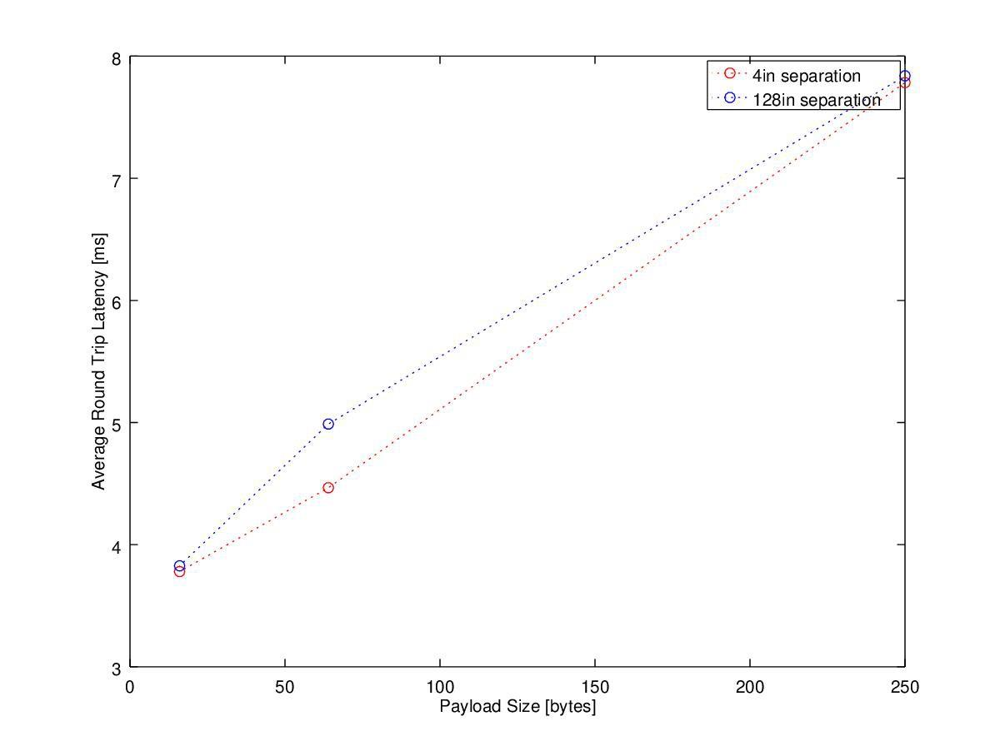

# 肥驴遥控 v2.0

## 源起

乐鑫发布了新的espnow通信协议，想尝试下，就有了这个小项目。

esp-idf v4.4

esp32c3

## 特征

esp now 

感谢：

dfrobot提供的板子：https://wiki.dfrobot.com.cn/_SKU_DFR0868_Beetle_ESP32_C3#target_5

舵机开源库：https://github.com/khoih-prog/ESP32_ISR_Servo

